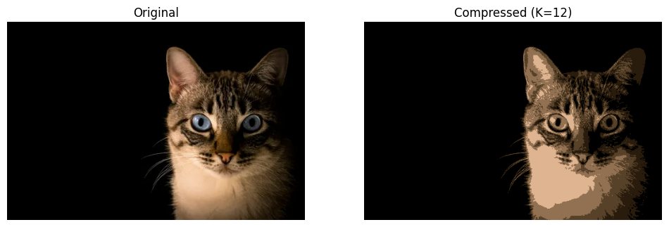

# K-Means Image Compression

Compressing images by reducing their color palette — built from scratch using NumPy, no sklearn.

## What it does

Every pixel in an image is an RGB value — three numbers between 0 and 255. A typical image can have millions of unique colors. This project uses the **K-Means clustering algorithm** to reduce an image down to just **K representative colors**, replacing every pixel with its nearest centroid color.

The result: a visually similar image that uses a fraction of the color information.

| K value | Effect |
|---|---|
| K = 2 | Near black and white |
| K = 8 | Rough shapes, limited palette |
| K = 12 | Good quality, visible detail |
| K = 32+ | Hard to distinguish from original |

## How it works

The algorithm runs in two alternating steps until convergence:

**Step 1 — Assign:** For each pixel, find the closest centroid by squared Euclidean distance in RGB space.

**Step 2 — Update:** Recompute each centroid as the mean of all pixels assigned to it.

Both steps are implemented manually in NumPy — no clustering libraries used.

```python
def find_closest_centroids(X, centroids):
    # assigns each pixel to its nearest centroid
    ...

def compute_centroids(X, idx, K):
    # recomputes centroids as mean of assigned pixels
    ...
```

## Implementation details

- Image reshaped from `(H, W, 3)` → `(H*W, 3)` for vectorized processing
- Centroids initialized via random permutation of pixel values
- Runs for a fixed number of iterations (default: 10)
- Compressed image reconstructed by mapping each pixel to its centroid color

## Results

Original image: 333 × 500 pixels = **166,500 RGB values**
Compressed with K=12: only **12 unique colors** represent the entire image



## Stack

- Python
- NumPy
- Matplotlib
- PIL (Pillow)
- Google Colab

## Context

Implemented as part of my ML learning journey following **Andrew Ng's Machine Learning Specialization**. The assignment spec provided the skeleton — every function was written and understood from scratch.

## Run it yourself

1. Clone the repo
2. Open `KMeansClustering_ImageCompression.ipynb` in Google Colab or Jupyter
3. Upload any image and set your desired `K` value
4. Run all cells